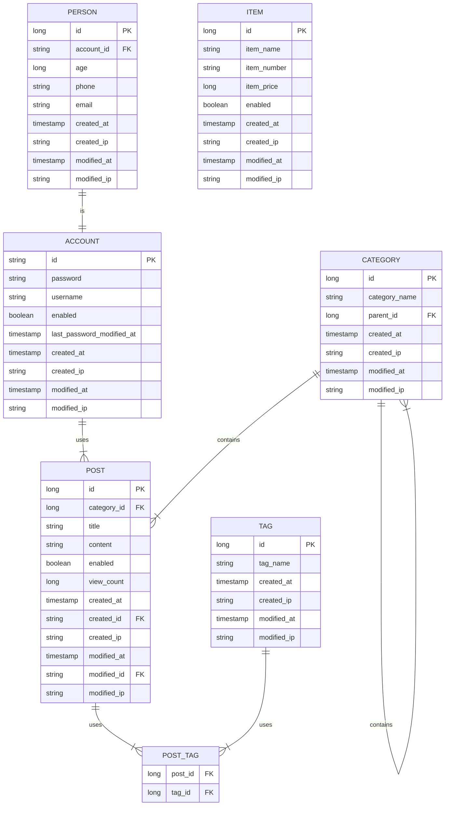

# Spring Data JPA Study

### 개요

본 프로젝트는 Spring Data JPA를 학습하기 위한 프로젝트입니다.

### ER

### 기술 스택

| 기술            | 버전    | 비고                        |
| --------------- | ------- | --------------------------- |
| Java            | 17      | 언어                        |
| Spring Boot     | 2.7.0   | 프레임워크                  |
| Spring Data JPA | 2.7.0   | DB 영속성 프레임워크        |
| Spring DevTools | 2.7.0   | LiveReload 사용 생산성 향상 |
| ModelMapper     | 3.1.0   | Entity, DTO간 변환          |
| H2              | 2.1.212 | 인메모리 DB                 |
| Lombok          | 1.18.24 | 보일러플레이트 줄이기       |

